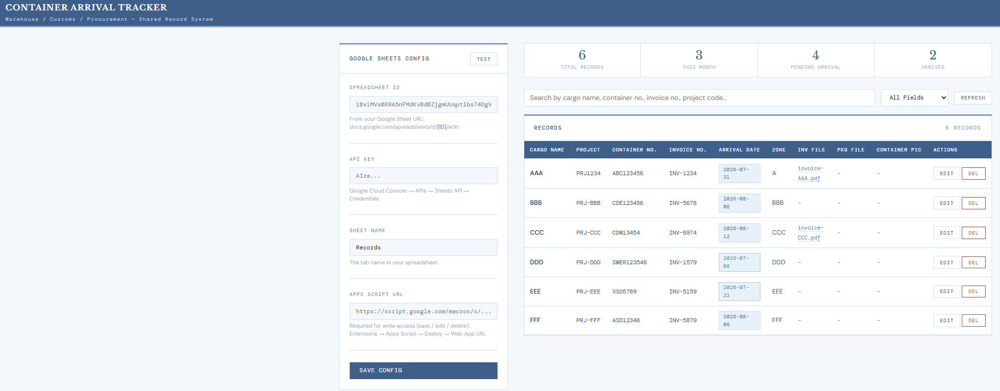
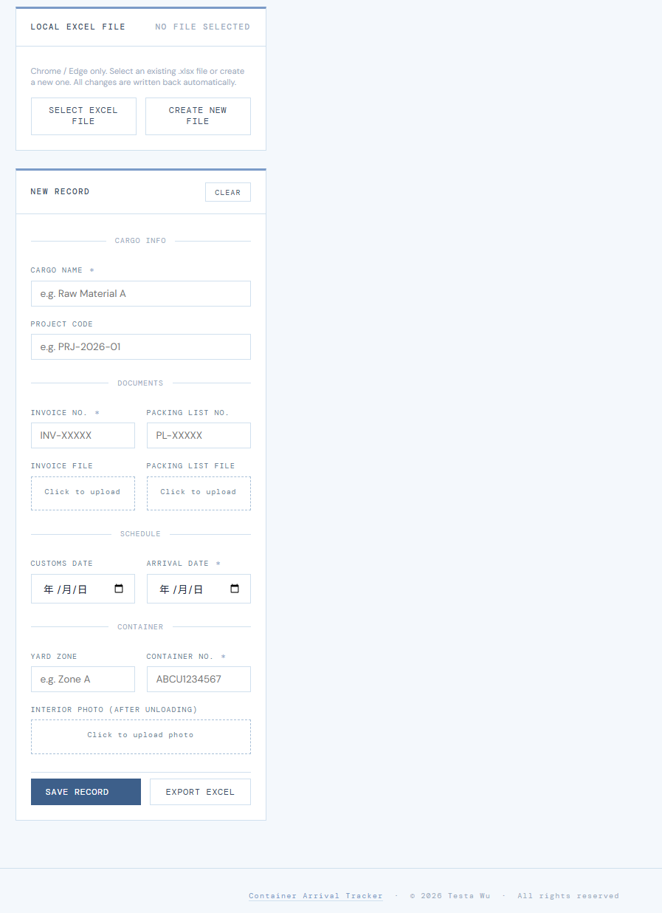

# 貨櫃到貨追蹤器
 
*[English](README.md)*
 
> 給倉庫、報關、採購三個部門使用的輕量級零基礎設施工具，即時追蹤貨櫃到貨並共享單據。
 
**線上展示 → [wutesta0101-hue.github.io/container-arrival-tracker](https://wutesta0101-hue.github.io/container-arrival-tracker/)**
 

 
---
 
## 問題
 
在傳統製造業與貿易公司，貨櫃到貨的資訊分散在三個部門手上：
 
```
採購    → 有 invoice 和 packing list
報關    → 知道清關日期
倉庫    → 不知道櫃什麼時候到
          也沒有單據可以核對貨物
```
 
結果是：倉庫人員毫無準備地到場，貨物核對全靠人工且容易出錯，延誤累積成滯箱費。
 
這個工具就是要補上這個斷點。
 
---
 
## 這個工具做什麼
 
一個三部門共用的單一 HTML 檔。採購上傳 invoice 與 packing list、報關登錄到貨日期之後，倉庫就能在同一個地方即時看到全部資訊。
 
v1 不需要伺服器。不用安裝。不用 IT 部門。
 
---
 
## 功能
 
| 功能 | 說明 |
|---|---|
| 貨物登錄表單 | 12 個欄位涵蓋所有到貨資訊 |
| 單據上傳 | Invoice 與 packing list 檔案附加 |
| 櫃內照片 | 卸櫃後的櫃況存證 |
| 搜尋 | 可依貨名、櫃號、invoice 號、專案代號查詢 |
| 本機 Excel 同步 | 自動讀寫本機 .xlsx 檔（Chrome / Edge） |
| Google Sheets 同步 | 跨部門共用資料庫 |
| Excel 匯出 | 一鍵匯出全部紀錄 |
| 本機儲存 | 離線可用，資料留存於瀏覽器 |
| 統計面板 | 總計、本月、待到貨、已到貨 |
 
---
 
## 三層儲存
 
依你的情況選一種，或三種併用。
 
```
第 1 層 — 瀏覽器 localStorage
永遠可用。零設定。資料留在瀏覽器。
離線可用。僅限單人。
 
第 2 層 — 本機 Excel 檔（僅 Chrome / Edge）
在電腦上選擇或建立一個 .xlsx 檔。
每次儲存 / 編輯 / 刪除都自動寫回同一個檔案。
沒有下載彈窗。單人使用，或透過 NAS / 網路磁碟共用。
 
第 3 層 — Google Sheets
多人共用資料庫。免費。不需伺服器。
需要 Google 帳號與一次性設定。
所有部門即時存取同一份資料。
```
 
---
 
## 快速開始 — 方案 A：本機 Excel 檔
 
適合：單人使用，或共用網路磁碟的團隊。
 
需要 Chrome 或 Edge。
 
1. 下載 `container-arrival-tracker-v1.html`
2. 用 Chrome 或 Edge 開啟
3. 在「本機 Excel 檔」面板點「建立新檔案」
4. 選擇 `.xlsx` 檔的儲存位置（例如共用網路磁碟）
5. 開始新增紀錄——每次變更都會自動寫入該 Excel 檔
下次開啟時：
 
1. 點「選擇 Excel 檔」
2. 選同一個 `.xlsx` 檔
3. 所有紀錄自動載入
若把 Excel 檔放在共用網路磁碟（NAS、公司檔案伺服器），團隊成員各自從自己的瀏覽器選取同一個檔案即可共用。
 
---
 
## 快速開始 — 方案 B：Google Sheets
 
適合：多人團隊、遠端存取、即時共享。
 
### 步驟 1 — 建立 Google Sheet
 
1. 前往 [sheets.google.com](https://sheets.google.com) 建立新試算表
2. 將第一個工作表改名為 `Records`
3. 將試算表分享給所有部門
### 步驟 2 — 取得 Spreadsheet ID
 
從 Google Sheet 的網址：
 
```
https://docs.google.com/spreadsheets/d/[SPREADSHEET_ID]/edit
```
 
複製 `SPREADSHEET_ID` 的部分。
 
### 步驟 3 — 建立 Google Cloud API Key
 
1. 前往 [console.cloud.google.com](https://console.cloud.google.com)
2. 建立新專案（或使用現有專案）
3. 啟用 Google Sheets API
4. 前往 憑證 → 建立憑證 → API 金鑰
5. 建議將金鑰限制為僅能存取 Google Sheets API
### 步驟 4 — 透過 Apps Script 啟用寫入權限
 
API Key 只提供唯讀權限。要能寫入（儲存 / 編輯 / 刪除），需依下列設定 Apps Script Web App。
 
1. 在你的 Google Sheet 中，前往 擴充功能 → Apps Script
2. 貼上以下程式碼：
```javascript
const SHEET_NAME = 'Records';
 
const HEADERS = [
  'ID', 'Cargo Name', 'Project Code', 'Invoice No.', 'Packing List No.',
  'Customs Date', 'Arrival Date', 'Yard Zone', 'Container No.',
  'Invoice File', 'Packing List File', 'Has Photo', 'Created At'
];
 
function doPost(e) {
  const sheet = SpreadsheetApp.getActiveSpreadsheet().getSheetByName(SHEET_NAME);
 
  if (sheet.getLastRow() === 0) {
    sheet.appendRow(HEADERS);
  }
 
  const data = JSON.parse(e.postData.contents);
  const action = data.action;
 
  if (action === 'append') {
    sheet.appendRow([
      data.id, data.cargo, data.project, data.invoiceNo, data.plNo,
      data.customsDate, data.arrivalDate, data.zone, data.containerNo,
      data.invoiceFile, data.plFile, data.hasPhoto, data.createdAt
    ]);
    return ContentService.createTextOutput(JSON.stringify({ status: 'ok' }))
      .setMimeType(ContentService.MimeType.JSON);
  }
 
  if (action === 'update') {
    const values = sheet.getDataRange().getValues();
    for (let i = 1; i < values.length; i++) {
      if (String(values[i][0]) === String(data.id)) {
        sheet.getRange(i + 1, 1, 1, 13).setValues([[
          data.id, data.cargo, data.project, data.invoiceNo, data.plNo,
          data.customsDate, data.arrivalDate, data.zone, data.containerNo,
          data.invoiceFile, data.plFile, data.hasPhoto, data.createdAt
        ]]);
        break;
      }
    }
    return ContentService.createTextOutput(JSON.stringify({ status: 'ok' }))
      .setMimeType(ContentService.MimeType.JSON);
  }
 
  if (action === 'delete') {
    const values = sheet.getDataRange().getValues();
    for (let i = 1; i < values.length; i++) {
      if (String(values[i][0]) === String(data.id)) {
        sheet.deleteRow(i + 1);
        break;
      }
    }
    return ContentService.createTextOutput(JSON.stringify({ status: 'ok' }))
      .setMimeType(ContentService.MimeType.JSON);
  }
 
  return ContentService.createTextOutput(JSON.stringify({ status: 'error', message: 'Unknown action' }))
    .setMimeType(ContentService.MimeType.JSON);
}
 
function doGet(e) {
  const sheet = SpreadsheetApp.getActiveSpreadsheet().getSheetByName(SHEET_NAME);
  const values = sheet.getDataRange().getValues();
  return ContentService.createTextOutput(JSON.stringify({ data: values }))
    .setMimeType(ContentService.MimeType.JSON);
}
```
 
3. 點 部署 → 新增部署作業
4. 類型：網頁應用程式
5. 執行身分：我
6. 存取權限：所有人
7. 點「部署」並複製 Web App 網址
### 步驟 5 — 設定追蹤器
 
用瀏覽器開啟 `container-arrival-tracker-v1.html`。
 
在「Google Sheets 設定」面板：
 
- 貼上 Spreadsheet ID
- 貼上 API Key
- 貼上 Apps Script Web App 網址
- 輸入工作表名稱（預設：`Records`）
- 點「測試」驗證連線
### 步驟 6 — 分享給團隊
 
**方案 A — 公司檔案伺服器 / NAS**
把 HTML 檔放在共用網路磁碟，所有人從同一個位置開啟。
 
**方案 B — GitHub Pages（免費）**
將 HTML 檔部署至 GitHub Pages，分享網址即可。
 
**方案 C — Cloudflare Workers（免費）**
將 HTML 檔作為靜態資源上傳。參見 [Cloudflare Workers 文件](https://developers.cloudflare.com/workers/)。
 
---
 
## 瀏覽器相容性
 
| 功能 | Chrome | Edge | Firefox | Safari |
|---|---|---|---|---|
| 所有基本功能 | 是 | 是 | 是 | 是 |
| 本機 Excel 檔 | 是 | 是 | 否 | 否 |
| Google Sheets | 是 | 是 | 是 | 是 |
 
---
 
## 檔案結構
 
```
container-arrival-tracker/
|
|-- sheets_v1/
|   |-- container-arrival-tracker-v1.html    主應用程式
|   `-- apps-script.gs                       Google Apps Script 程式碼
|
`-- README.md
```
 
---
 
## 紀錄欄位
 

 
十一個欄位，分為貨物、單據、時程、貨櫃四組。標星號者為必填，其餘可在其他部門的資訊陸續進來後再補。
 
| 欄位 | 必填 | 說明 |
|---|---|---|
| 貨物名稱 | 是 | 貨物描述 |
| 專案代號 | 否 | 內部專案編號 |
| Invoice 號碼 | 是 | 供應商發票號碼 |
| Invoice 檔案 | 否 | PDF 或圖片上傳 |
| Packing List 號碼 | 否 | 裝箱單編號 |
| Packing List 檔案 | 否 | PDF 或圖片上傳 |
| 清關日期 | 否 | 報關送件日期 |
| 到貨日期 | 是 | 預計或實際的貨櫃到貨日 |
| 儲區 | 否 | 存放區域代號 |
| 櫃號 | 是 | ISO 貨櫃編號（例：ABCU1234567） |
| 櫃內照片 | 否 | 卸櫃後的櫃內照片 |
 
---
 
## 發展藍圖
 
### v1 — 現行版本
- 單一 HTML 檔，零依賴
- 三層儲存：localStorage、本機 Excel、Google Sheets
- 以 File System Access API 自動讀寫本機 Excel
- Google Sheets 以 API Key 讀取、以 Apps Script 寫入
- Excel 匯出
- 統計面板
### v2 — 後端
- FastAPI + SQLite / PostgreSQL
- 多使用者驗證
- 角色權限控管（採購 / 報關 / 倉庫）
- 檔案儲存（本機或 S3 相容）
- 供 ERP 介接的 REST API
- Docker Compose 自架部署
- 稽核紀錄（誰在何時改了什麼）
### v3 — 通知
- 到貨日期接近時以 Email / LINE 通知
- Slack / Teams webhook 整合
- 行動裝置最佳化檢視
---
 
## 為什麼做這個
 
這個工具源自第一線倉儲作業經驗。
 
**問題不是技術性的，是組織性的。**
 
採購有單據。報關有時程。倉庫兩者皆無。
 
傳統產業對此的標準反應是：那不是我的部門。結果就是倉庫人員在沒有資訊的情況下等待、貨物到場卻沒有單據可核對，而各部門忙著翻找文件的同時，滯箱費持續累積。
 
一套權責清楚的共用紀錄系統，可以完全消除這件事。
 
更完整的說明：[How I Built a Zero-Infrastructure Tool to Fix a Cross-Department Information Problem](https://medium.com/@wutesta0101/how-i-built-a-zero-infrastructure-tool-to-fix-a-cross-department-information-problem-8820a4c7f095)
 
---
 
## 技術組成
 
| 層 | 技術 |
|---|---|
| 前端 | HTML、CSS、JavaScript（原生） |
| 檔案讀寫 | File System Access API |
| 檔案匯出 | SheetJS (xlsx) |
| 資料庫 (v1) | Google Sheets via Sheets API |
| 寫入權限 (v1) | Google Apps Script Web App |
| 本機備援 | localStorage |
| 部署 | Cloudflare Workers / GitHub Pages / NAS |
 
---
 
## 回饋
 
這是一個作品展示專案，不是開源函式庫——但實務上的回饋非常歡迎。
 
如果你在倉庫、報關或採購工作，覺得這裡有哪些地方不符合你們實際的運作方式，歡迎開一則 issue。真實的作業回饋會影響發展方向。


---
## 相關專案

**[三維貨櫃裝箱系統](https://github.com/wutesta0101-hue/container-packing)** — 模擬堆高機物於貨櫃內裝疊貨物的**物理行為**。

**[電動移動貨架 揀貨序列最佳化](https://github.com/wutesta0101-hue/emr-scheduling)** — 密集式移動貨架的揀貨**3D可視化**。

---

**授權** — © 2026 Testa Wu。保留所有權利。僅供作品展示用途。


